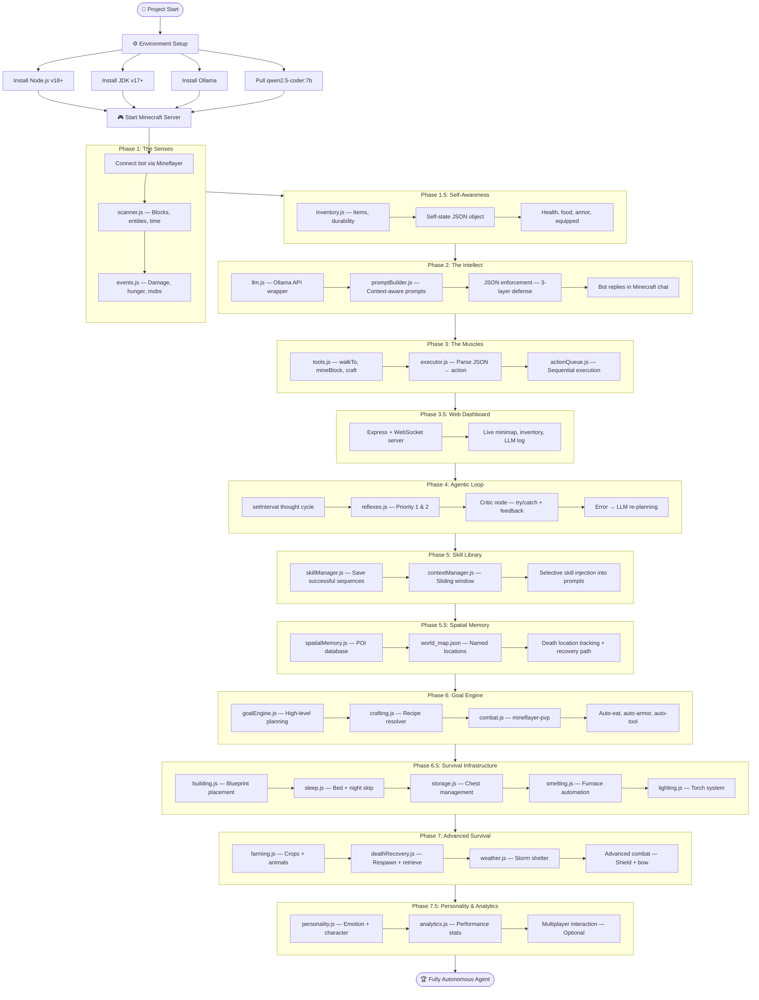
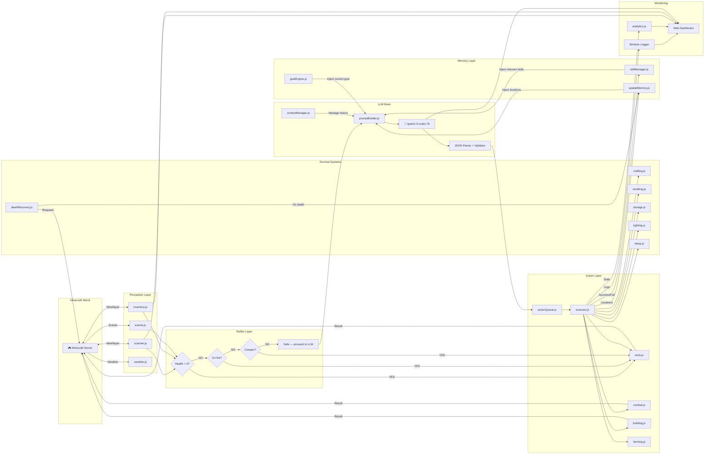
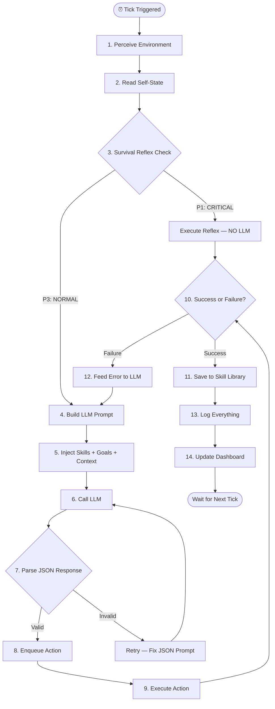
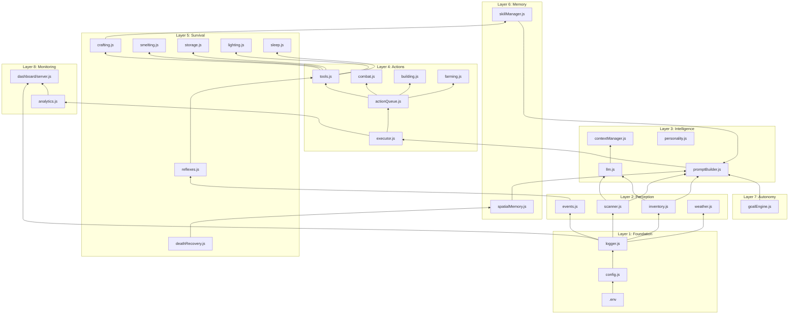
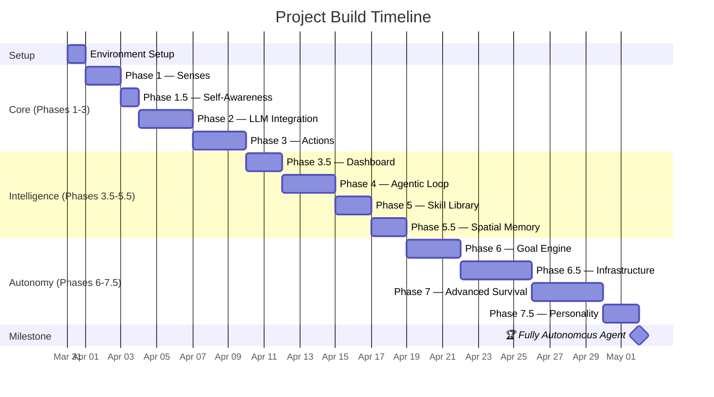
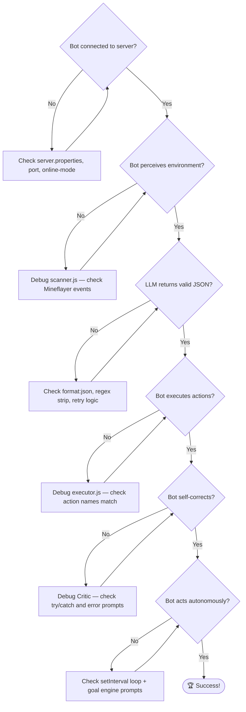

# 🔄 Project Workflow: Autonomous Minecraft AI Agent

> This document shows the complete workflow of the project — how all phases connect,
> how data flows through the system, and the build order.

---

## 📋 Build Order Workflow

---

## 🧠 Runtime Architecture (Data Flow)

---

## 🔄 Agentic Loop (Single Tick)

---

## 🏗️ Module Dependency Map

---

## 📊 Phase Timeline (Estimated)

**Estimated Total: ~32 days of focused development**

---

## 🎯 Key Decision Points

